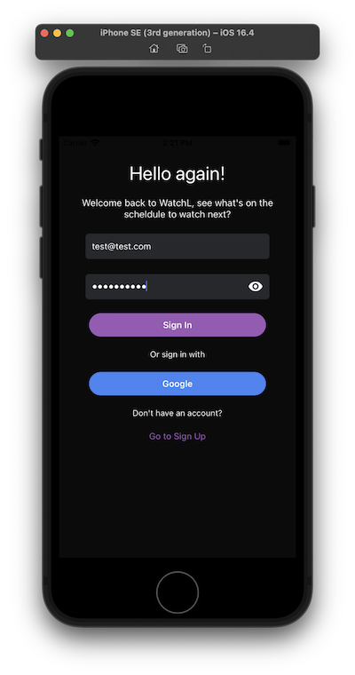
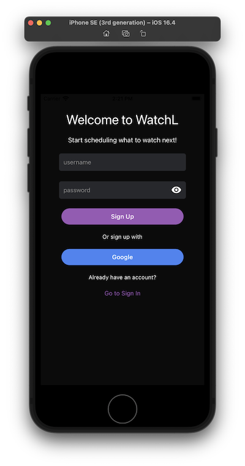
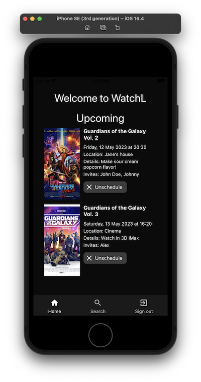
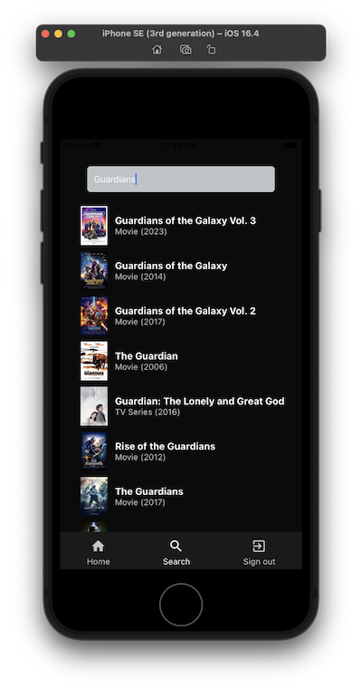
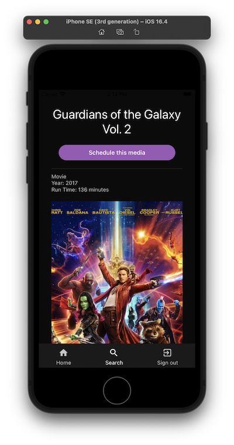
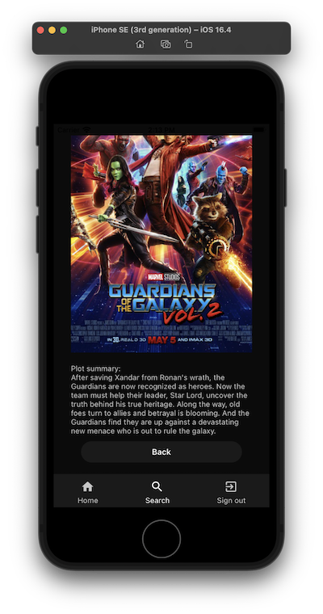
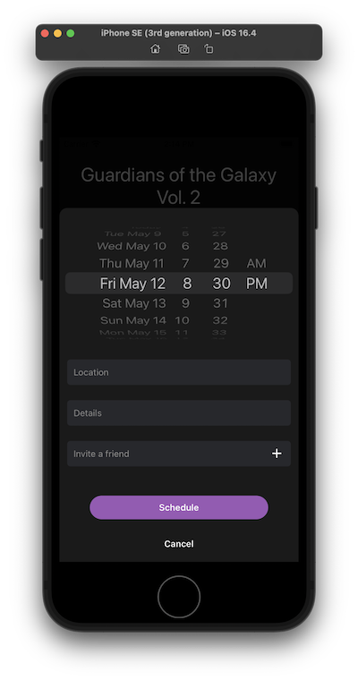
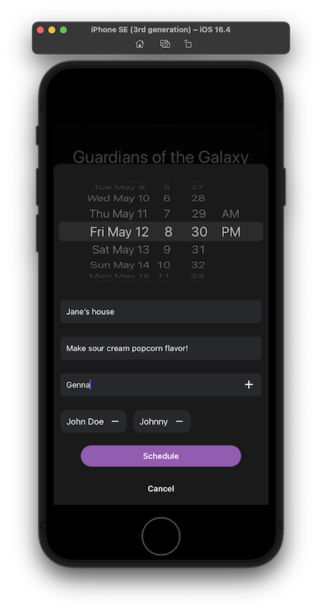
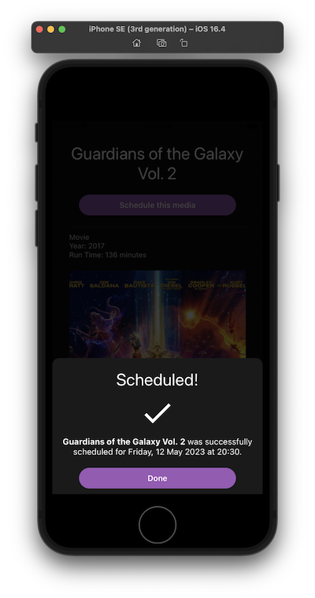

# WatchL 

WatchL is a mobile focused application that allows users to search for movies or TV series and schedule them. It is built using React Native and powered by Expo. This repository contains the front-end code for the app. Integrate it with the backend from [this repo](https://github.com/panisara-bd/watchl-backend). 

To get the app running properly, you will need to clone the backend repository as this project uses terraform to deploy the fetching from a third-party API to get the movies/tv-shows details.

## Getting Started

To get started with WatchL, you'll need to have Node.js and Expo CLI installed on your machine. You can install Node.js from the official website, and Expo CLI can be installed using npm:
```sh
npm install -g expo-cli
```

Once you have the prerequisites installed, you can clone the repository and install the dependencies:
```sh
git clone https://github.com/panisara-bd/watchl-app.git
cd watchl-app
npm install
```
Finally, you can start the development server:
```sh
npm start
```
This will start the Expo development server and open the app in your local simulator.

## Usage

To use WatchL, simply open the app and search for a movie or TV series by tapping on the search icon at the bottom bar. You can browse through the results and tap on a title to see more information about it, including a brief summary, running time, and year.

## Features

- Login / Sign up 




- Home: where you can see your scheduled medias, delete, or update the details.



- Search: search media you want to schedule from IMDb API.



- Read the detail before scheduling the media.




- Schedule: Schedule the media and add the information including time, location, invites and other details.
 



- Confirmed scheduled media



### Front-End Tech Stack
- React Native application with Expo
- TypeScript
- AWS Ampliy (Authentication)

## Future Developement

This is an ongoing project and there are other features to be added, such as adding calendar view, writing tests, push notifications, and make sure the app works properly on web.

If you find a bug or have a feature request, please open an issue on GitHub. If you would like to contribute code, please fork the repository and submit a well-documented pull request.

## License

WatchL is licensed under the MIT License. See the LICENSE file for more information.